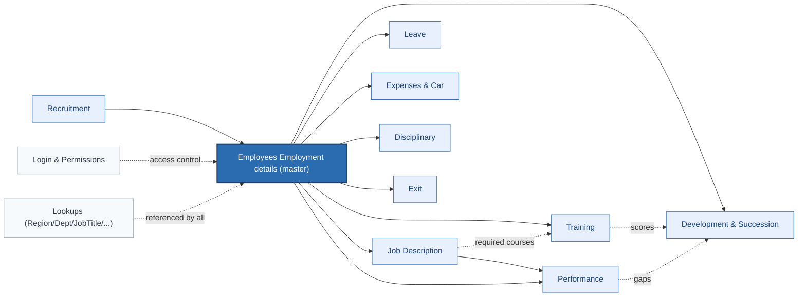

# HR Database Workflow — `Database_2ndCopy.accdb`

**73 tables · 17 queries · 32 enforced relationships.** This is a Microsoft Access HR management system, structured as a hub-and-spoke around `Employees Employment details`.

> Open `Database_Workflow.html` in a browser for the rendered diagrams. The Mermaid source is reproduced below for reuse.

---

## 1. High-level system map

## 2. Recruitment & onboarding

`tblRequest → Recruitment → tblInterview/tblQue → tblEmpInterview → tblMainSHeetInterview → tblEvaluation → tblActualRecruitment → tblEmpTake → Employees Employment details`

EE compliance is verified against `tblRecruitmentTarget` / `tblRecruitmentAppData`. Rejected candidates are tracked through `tblNonRecruitmentReason`.

## 3. Job description hierarchy

`TblJobTitle → TblJobdescriptionDetailRecord` is the anchor; from there you get:

- `TblJobDescriptionEntryRecord` — the JD text
- `TblJobDesRolesAndResponsibility` — duty list
- `TbJobDescriptionlKPIEntry` — KPIs
- `TblJobDesInternalTrainingEntry` / `TblJobDesExternalTrainingEntry` — required courses
- `TblEmployeJobDescriptionDetails` — assigns a JD to an employee
- `tblEvaluation` — JD grading with CEO approval

## 4. Training

Catalogue `TblAllTrainings` → bookings in `TblEmployeeInternalTrainingDetails` / `TblEmployeeExternalTrainingDetails` → workflow on `TblAnalysisSkils` (booking · approval · PO · start/end · certificate). Internal courses use a quiz pipeline: `tblQue → tblAnswers → tblEmpTest → qryFinalResult`.

## 5. Performance → Development → Succession

`TblEmployeePerformence` (with `TblKPI`/`TblKPICategory`) feeds gap analysis into `tblDevelopement`, which branches into `tblQualDev`, `tblSkillsDev`, `tblDevExp`. Each plan carries `LineManager / HR / Compliance / EXCO` approval columns.

Critical roles flow into succession: `tblCritical → tblCriticalSkills → tblSuccession → tblSuccAppData / TblScheme / TblScommitment / TblSPosition`.

## 6. Leave · Expenses · Disciplinary

| Module | Main table | Lookups | Approval pattern |
|---|---|---|---|
| Leave | `TblLeaveForm` | `TblTypeofLeave` | Manager → HR (`EmailStatus`) |
| Expenses | `TblExpense` (+ `tblCarScheme`) | `TblExpenseCategory · TblCostOfSale · tblActivities · tblOverheads · TblDepot` | `MangerApproval`, `ApprovedBy`, `tblApproval` |
| Disciplinary | `TblDisciplinary` | `tblNatureOfOffence · tblDisciplinaryAction · TblCriminalReport` | Inline `Who` + open/close dates |

## 7. Authentication

`LoginDetails` (UserName · Password · Admin/Editor/User flags) is paired with `tblPermissions` (per-screen flags for Admin and three user levels). This is a row-per-screen permission grid, not role-based RBAC.

---

## Notes

- **Hub-and-spoke.** `Employees Employment details` (108 columns) is the single source of truth — every transactional table joins back to it.
- **Approvals stored as columns**, not as a workflow engine. Each approver is an extra field on the transactional record (`LineManager`, `HR`, `Compliance`, `EXCO`).
- **South African context.** Paterson grading, NBC council, EE groups, and SARS tax columns indicate SA labour-law reporting.
- **Staging tables** (`tblTmpRec`, `tblTmpEmp`, `tblTmpQue`, `tblTmpExp`, `Paste Errors`) suggest Excel imports.
- **Only 32 enforced FKs.** Many logical joins (e.g. `Employees Employment details.Department → TblDeparment.DepID`) exist only by convention. Access queries paper over the missing referential integrity.
